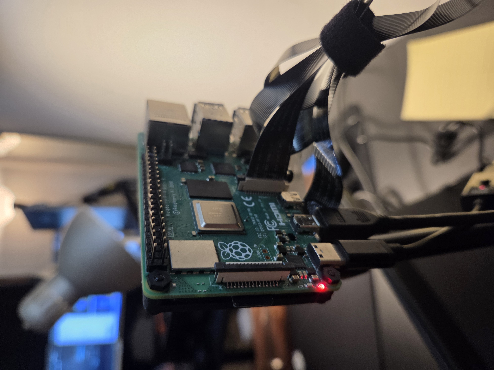
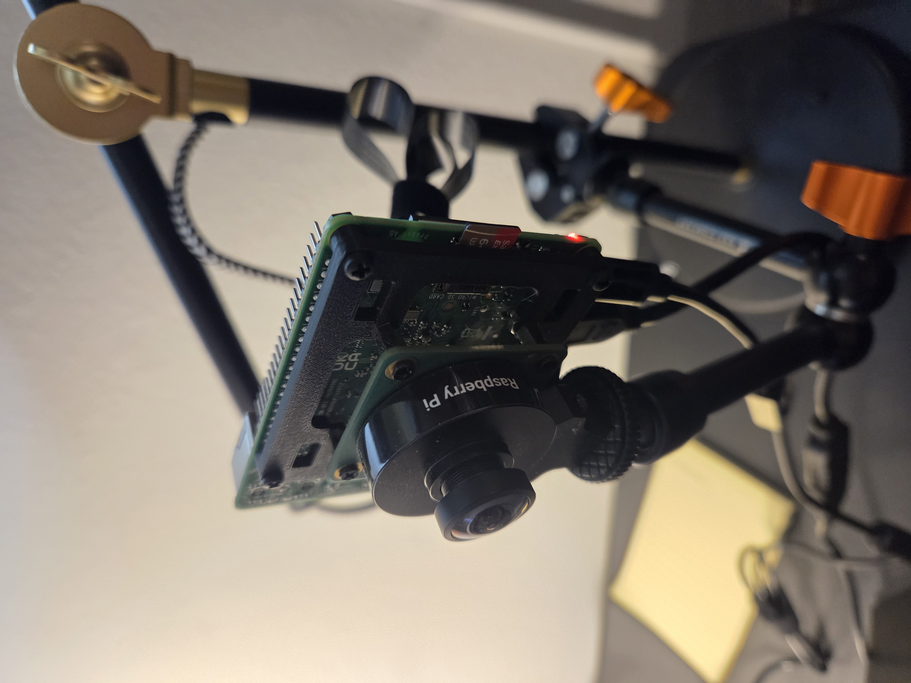
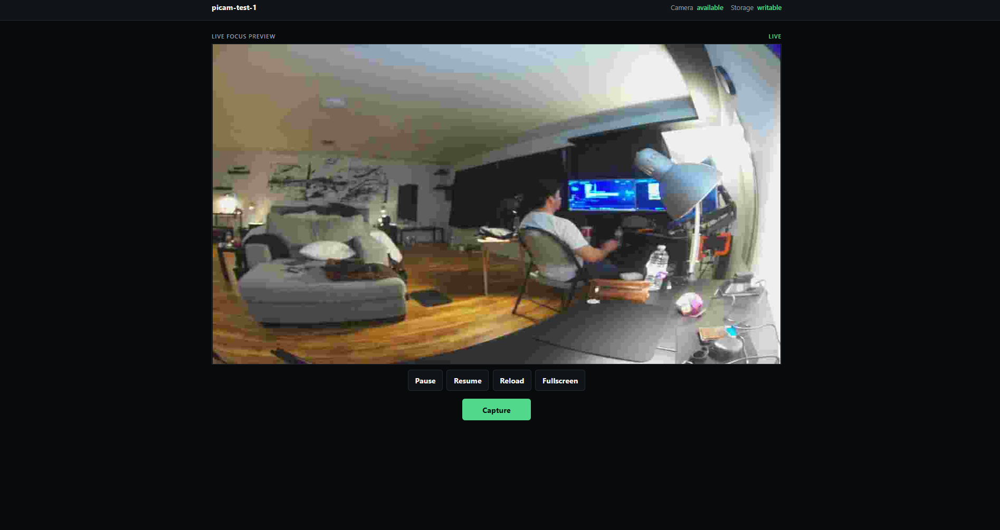

# picam-test-1

A minimal Raspberry Pi camera application built using Flask and Picamera2.

The project demonstrates a clean, incremental implementation of a browser-controlled Raspberry Pi camera while also serving as a testbed for a structured multi-agent development workflow using Nimbalyst.

## Hardware



**Raspberry Pi Camera Platform**

Raspberry Pi 4 Model B (4 GB RAM) running Raspberry Pi OS with the Raspberry Pi HQ Camera (Sony IMX477 12.3 MP) connected through the CSI interface.

Software stack:

- Python 3
- Flask
- Picamera2
- libcamera

This hardware platform provides live MJPEG streaming, full-resolution image capture, and runtime camera control.

### Camera Module



**Raspberry Pi HQ Camera (Sony IMX477)**

The Raspberry Pi HQ Camera provides full-resolution still capture while simultaneously delivering a low-resolution MJPEG preview stream.

The application maintains a single server-owned Picamera2 instance, allowing streaming and image capture without restarting or reconfiguring the camera.

## Web Interface



**Milestone 6 Browser Interface**

The browser interface includes:

- Live MJPEG preview
- Capture button
- Pause preview
- Resume preview
- Reload preview stream
- Fullscreen mode
- Responsive desktop and mobile layout
- Runtime camera settings API

## Features

- Live MJPEG browser preview
- Full-resolution image capture
- Runtime camera settings API
- Browser preview controls
- Responsive interface
- Single shared Picamera2 instance
- Graceful startup and shutdown
- Concurrent streaming and still capture

## Requirements

- Raspberry Pi with a camera supported by `rpicam`
- Python 3
- Raspberry Pi OS Picamera2 package

The virtual environment uses system site packages because Raspberry Pi OS provides Picamera2 and its native camera dependencies.

## Installation

```bash
cd /home/diego/picam-test-1
python3 -m venv --system-site-packages .venv
source .venv/bin/activate
python -m pip install -r requirements.txt
```

## Command-line Capture

Capture one image:

```bash
.venv/bin/python capture.py
```

Capture three images with one second between captures:

```bash
.venv/bin/python capture.py --count 3 --delay 1
```

Use a different output directory:

```bash
.venv/bin/python capture.py --output storage/test-images
```

## Browser Interface

Start the server:

```bash
cd /home/diego/picam-test-1
.venv/bin/python app.py
```

Open this URL from another device on the same network:

```text
http://192.168.1.97:5000
```

The dark monitor page shows camera and storage status, a responsive 1280x720 live preview at approximately 12 FPS, and one Capture button. Captured full-resolution JPEGs are saved under `storage/images` but are not displayed on the home page. The interface has no authentication and is intended only for a trusted local network.

### Preview Controls

- **Pause** disconnects the browser from the MJPEG stream.
- **Resume** starts a new connection to the stream.
- **Reload** replaces the current stream connection without reloading the page.
- **Fullscreen** opens the 16:9 preview container with the browser Fullscreen API. Press Escape or use Exit fullscreen to return.

The state label reports Live, Paused, or Reconnecting. These controls affect only the local browser and do not stop or reconfigure the Raspberry Pi camera.

### Adjust Focus

1. Start the server and open the browser URL.
2. Keep the full preview frame visible while resizing or positioning the browser.
3. Turn the physical lens focus ring slowly until the subject is sharp.
4. Press Capture to save a full-resolution JPEG under `storage/images`.
5. Stop the server with Ctrl+C when finished.

## API Routes

- `GET /` - browser remote
- `POST /capture` - capture one full-resolution image
- `GET /latest` - newest full-resolution JPEG
- `GET /status` - JSON status
- `GET /stream` - 1280x720 MJPEG focus preview
- `GET /settings` - current camera settings with supported ranges
- `POST /settings` - update camera settings (JSON, partial updates allowed)

## Settings API

Supported settings: `brightness`, `contrast`, `saturation`, `sharpness`, and `exposure_compensation`.

`GET /settings` returns each setting with its current value, minimum, maximum, and default. `POST /settings` accepts partial updates and validates values against the hardware-supported ranges.

Example endpoint requests:

```bash
curl http://192.168.1.97:5000/status
curl -X POST http://192.168.1.97:5000/capture
curl http://192.168.1.97:5000/latest --output latest.jpg
curl http://192.168.1.97:5000/settings
curl -X POST \
  -H "Content-Type: application/json" \
  -d '{"brightness": 0.3, "contrast": 2.0}' \
  http://192.168.1.97:5000/settings
```

## Project Timeline

### Milestone 1

- Command-line image capture

### Milestone 2

- Flask web server

### Milestone 3

- Browser interface

### Milestone 4

- Live MJPEG preview

### Milestone 5

- Streaming reliability improvements
- Responsive UI
- Graceful shutdown

### Milestone 6

- Browser preview controls
- Camera settings API

## Scope and Future Work

The current release provides still-image capture, live MJPEG focus preview, browser preview controls, and runtime camera settings. It does not include video recording, timelapse, cloud upload, AI, authentication, or a database.
